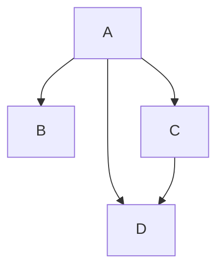

- [ ] 👍Deploy a generic method to compute the `X for Y` discount offers, covering `Three for two` and `Two for one` offers
    - [ ] 👍Prepare the code for an easy addition of the `X for Y` discount type family
        - [ ] ...
            - [ ] ...
    - [ ] 👍Implement the `Two for one` discount computation
        - [ ] ...
    - [ ] 👍Refactor the existing code to use the `X for Y` discount computation method with the `Three for two` discount
- [ ] Parking-Lot (any change with no direct impact on the main goal)
    - [ ] ...

